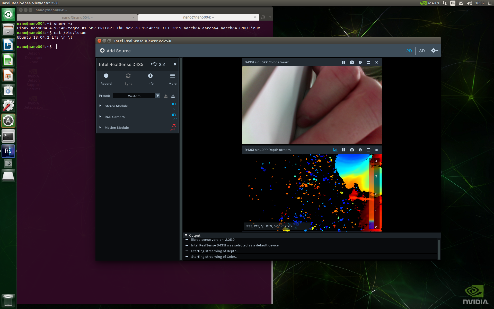
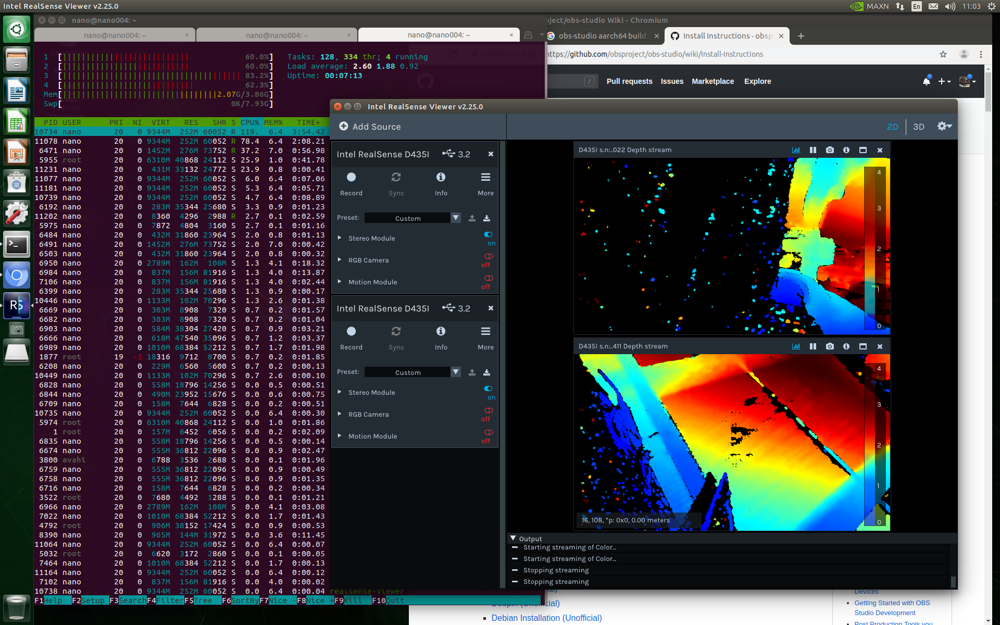
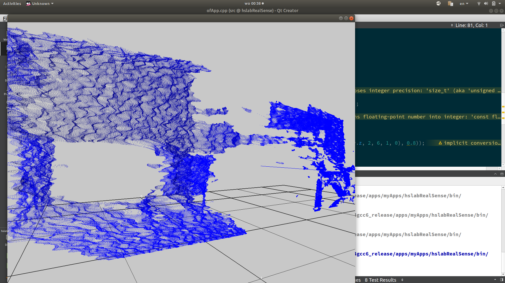
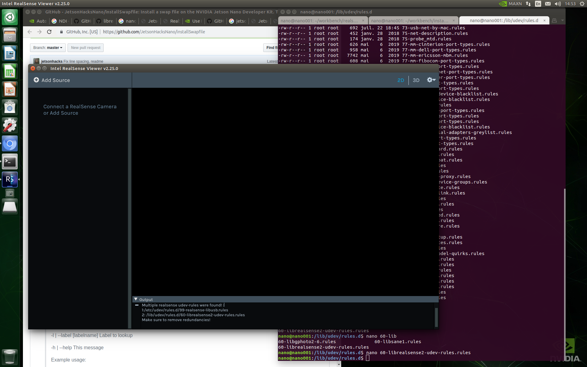
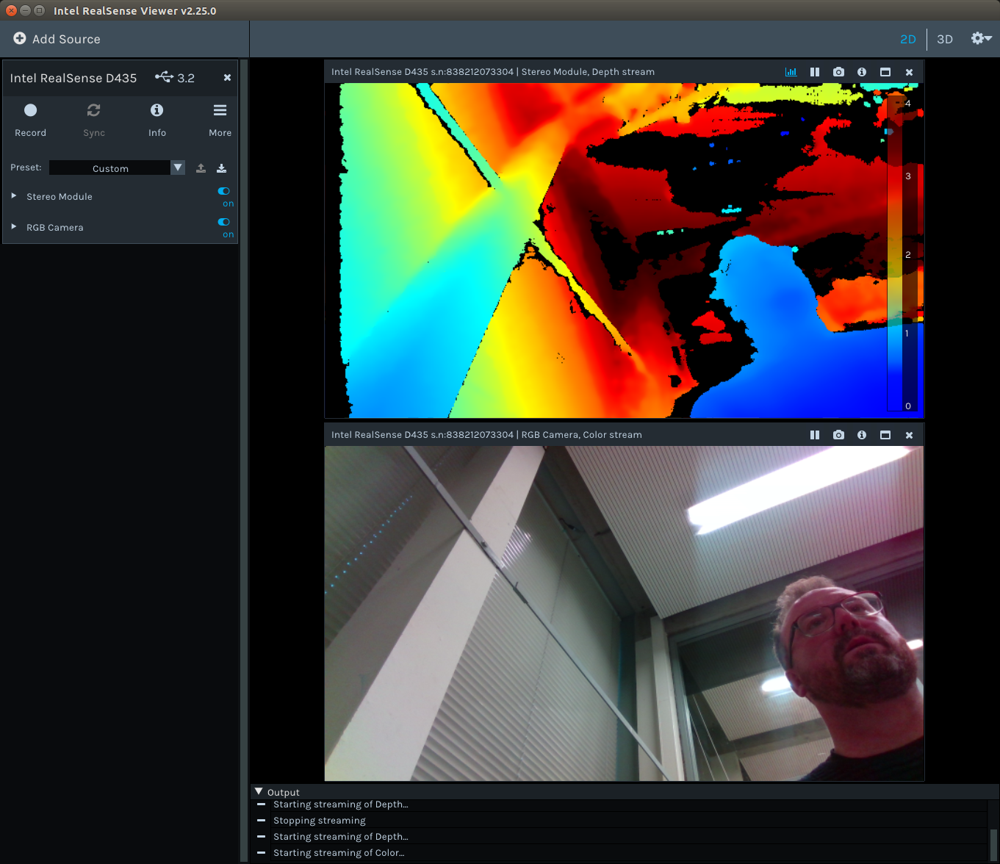

# Anrhem's DATA HSLab rig

Related repos:
- this repo with the journal, documentation and patches [IDArnhem/hslab-rig-realsense](https://github.com/IDArnhem/hslab-rig-realsense)
- our Ubuntu port of the NDI openframeworks addon [IDArnhem/ofxNDI](https://github.com/IDArnhem/ofxNDI)
- pointcloud acquisition OF sketch [IDArnhem/hslab-RealSense](https://github.com/IDArnhem/hslab-RealSense)
- our fork of the ofxRealsense2 openFrameworks addon [IDArnhem/ofxRealsense2](https://github.com/IDArnhem/ofxRealsense2) the stock version was outdated and does no longer work with latest SDK from Intel, this one works fine
- testbed for NDI on openFrameworks (currently crashing) [IDArnhem/hslab-NDItest](https://github.com/IDArnhem/hslab-NDItest)

## Roadmap

As per 29 NOV we think that this is what's left to do to have a nicely working rig that is usable for our students:

- NDI streaming of video and depth buffers from the cameras
- a service that allows you to stream point cloud data from any of the cameras
- dashboard page with status of all the devices:
    - the device status
    - the streams it publishes (with names)
    - any other services available (OSC?)
    - a simple interface to keystone the video feed to the beamers
    - an NDI receiver on the Jetson nano
- projection mapping
- tracking camera
- microphones
- examples / wiki
- unity receiver for pointcloud
- iterative Closest point
- automatic calibration (qr code for example)
- making tracking sensors vr


## Journal

## Day 4 (29/11)

### Porting the ofxNDI library
I ported an openFrameworks library to Linux, I managed to make it compile but it is not yet working due to the special way that the developers load the NDI dynamic library. This will require further work and possibly consulting the original developers about the best way to proceed with the port. I wil park this work until next week. The HSLab version of the ofxNDI library can be found in this repo [IDArnhem/ofxNDI](https://github.com/IDArnhem/ofxNDI).

### Stabilizing software setup

Overnight I recompiled the kernel using the `patchUbuntu.sh` script in the [JetsonHacksNano/installLibrealsense](https://github.com/JetsonHacksNano/installLibrealsense), starting from the **JP 4.2.2** version of the Nvidia Jetson Nano distribution. This updated the necessary kernel modules to be able to work with the RealSense D435i. I tested with 1, 2, 3 and 4 cameras to see what the Jetson was capable of. One camera worked pretty well, though not as smooth as on my laptop.





Both these screenshots were taken on a Jetson Nano, running this kernel `Linux nano004 4.9.140-tegra #1 SMP PREEMPT Thu Nov 28 19:40:18 CET 2019 aarch64 aarch64 aarch64 GNU/Linux`, and this version of the OS `Ubuntu 18.04.3 LTS`.

### Patching openFrameworks

I downloaded `openFrameworks v0.10.1`, the currently stable version, for `armv7l linux`, it requires a few adjustments to compile in the Jetson Nano. So I made the adjustments by hand and created a patch file that you can find in this repo.

To apply the patch you need to be one directory up from the openFrameworks root and then type this:

```
patch -s -p0 < of-v0.10.1__jetson_nano.patch
```

Next, we need to recompile and build the kiss and tess2 libraries with these modified settings. You can download oF's apothecary tool to recompile the libraries:

After applying the patch you need to build two binary dependencies by hand using openFraeworks `apothecary`:

```
git clone https://github.com/openframeworks/apothecary.git
cd apothecary/apothecary
./apothecary -t linux download kiss
./apothecary -t linux prepare kiss
./apothecary -t linux build kiss
./apothecary -t linux download tess2
./apothecary -t linux prepare tess2
./apothecary -t linux build tess2
```

And then place those binaries in their proper locations in the openFrameworks directory structure:

```
$ cp apothecary/apothecary/build/kiss/lib/linux/libkiss.a of_v0.10.1_linuxarmv7l_release/libs/kiss/lib/linuxarmv7l/
$ cp apothecary/apothecary/build/tess2_patched/build/libtess2.a of_v0.10.1_linuxarmv7l_release/libs/tess2/lib/linuxarmv7l/
```

Then you are ready to compile openFrameworks.

### Adding remoting capabilities to the Jetson

I installed the following packages:
- `iftop`, `nload`, `tcptrack` for network load monitoring
- installed `xrdp` for Remote Desktop support on the Jetson (better than VNC as VNC requires a user session and can't be used headless)
- installed `mosquitto` for mqtt monitoring (to do a web-based dashboard)
- installed VS Code
- created a default `ssh` key without a password, which is located in the default location `~/.ssh/id_rsa` (to facilitate using git from the nano itself)
- installed all the openFrameworks dependencies and video codecs for `gstreamer`.
- compiled openFrameworks

### Remote access

You have multiple choices here. You can `ssh` into the Nanos, or you can use Remote Desktop to access a full desktop session. All nanos have `nano0XX` as hostname, where `XX` is their number in the rig.

To ssh into one you just open up your terminal and type:
```
ssh nano@nano004.local
```

and that will get you into `nano004`.

You can get the password from Doeke.

Similarly you can install a Remote Desktop client for your OS (this is broadly supported in all platforms) and log into the nano of your choice by using it's node name (e.g. nano004.local), and the same user account for the desktop and same password. This will give you a desktop session.

### Power setup for rig

This is mostly a note for Doeke, remember that you have these PoE injectors that can step voltage to a specific rating. [Here's one example](https://www.netcamshop.nl/foscam-poe5912g-poe-splitter-power-output-5v-9v-12v-ieee-802-3af/pid=58137), remember also to get 1Gbps-capable ones.

Together with a 1Gbps PoE switch [like this one](https://www.newegg.com/global/nl-en/p/N82E16833122817), and you can do away with the dumb transformer of the Jetson Nano.

## Day 3 (28/11)

### Downgrading

I tried downgrading one of the nanos to run the `JP 4.2.2 2019/08/26` [(download link)](https://developer.nvidia.com/jetson-nano-sd-card-image-r3221) release of the OS, it's a few months old, but it seems to be the one that can be patched safely. I tried other versions with disastrous results, so it is crucial that you start from this version.

### Remote Desktop
To do remote administration of the Jetson you are going to need some kind of *Remote Desktop*, VNC will need you to have an active desktop session in the Jetson, so you can't run it headless. For a headless remote desktop it is better to install RDP (Remote Desktop Protocol):

`sudo apt-get install xrdp`

### openFrameworks

#### Add-on for RealSense
Forked the `ofxRealsense2` addon and updated the headers and library versions to match the current distribution of Intel's SDK. This was necessary because the openFrameworks code I wrote refused to run because it detected a mismatch between the library in the system and the headers I used to compile it. The fork is on [IDArnhem's github](https://github.com/IDArnhem/ofxRealsense2).

#### Pointcloud acquisition test

I pushed a test that lists the available cameras and acquires a pointcloud from the last camera available. You can get it here [IDArnhem/hslab-RealSense](https://github.com/IDArnhem/hslab-RealSense), you will need the add-on above to compile it. Eventually the same workflow can be used for multiple cameras.



#### NDI streaming test with OBS Studio

Doeke and I made a simple test using [OBS Studio](https://obsproject.com) with the [NDI plugin](https://github.com/Palakis/obs-ndi/releases/tag/4.7.1). We plugged our computers to the classroom ethernet and setup a stream with my computer as an NDI source and Doeke's as an NDI sink. OBS made the process supersimple and the video quality was quite impressive, there was only a few milliseconds lag for full frame HD video. We determined that this was the best way to go to acquire the buffers from the depth cameras.

Another finding from this experiment is that **a single NDI stream at 60fps HD was taking up about 70Mbps of ethernet bandwith**. This means that a 100Mbps switch would struggle to take the peaks of 4 or 5 streams. Therefore a 1Gbps switch will be needed.

## Day 2 (26/11)

#### Setting up the Jetsons
- Downloaded a NVIDIA's stock Jetson distro from the official site: https://www.developer.nvidia.com/embedded/downloads
- Flashed 6 SD cards to have as many devices to work through the week

#### Setting up the RealSense cameras
- Unpacked all the RealSense D435i and rigged them on the provisional pipe rig
- Updated the firmware of each one of them from my Ubuntu laptop
- Got a USB 3 hub (5Gbps) and tested all four cameras (D435i) *on my laptop*:
    - getting all 4 video feeds works fine
    - getting all 4 depth buffers works fine too
    - but getting both pixel and depth starts dropping frames

#### Setting up RealSense on Jetson

[The stock RealSense linux install instructions](https://github.com/IntelRealSense/librealsense/blob/master/doc/distribution_linux.md) will not work on the NVIDIA Jetson, some of the commands will complete successfully, others will not. The Jetson, like the Raspberry Pi needs `arm` builds for all binaries, so you need to build from source or find binaries.

[This article](https://www.jetsonhacks.com/2019/05/16/jetson-nano-realsense-depth-camera/) explains the painful process you are about to embark on.

I downloaded the contents of this repo [JetsonHacksNano/installLibrealsense](https://github.com/JetsonHacksNano/installLibrealsense) and executed `./installLibrealsense.sh` but it ran out of RAM half-way through compilation. So it is recommended that you first create a swap file, so that this happen to you. To create the swap file I used a script that you can get an run like this:

```
curl -s https://raw.githubusercontent.com/JetsonHacksNano/installSwapfile/master/installSwapfile.sh | bash
```

This script will ask a few questions but if you press enter in each of them it will run with reasonable defaults and create a 8Gb swap file that should be enough to compile `librealsense2`. Now you are ready to go back to the directory where your `./installLibrealsense.sh` script is and run it. This will take about 40m, so it's a good time to go and grab a coffee.

#### NDI

Doeke brought up NDI, seems like a fairly solid standard for video over IP that is supported by _Touch Designer_ among others. Looking for a straightforward way to pump NDI video, I found that [OBS has a plugin](https://github.com/Palakis/obs-ndi/releases/tag/4.7.1), that allows to choose NDI as source and also configure NDI as output.

I also found this repo [jadsys/NDI-Video-Sender_Receiver](https://github.com/jadsys/NDI-Video-Sender_Receiver) that seems to have some kind of streaming server.

###### NDI SDK

Newtek has a NDI SDK, but it is hidden behind a dumb signup form, these are the direct links: [NDI SDK for Windows](http://new.tk/NDISDK), [NDI SDK for iOS and OSX](http://new.tk/NDISDKAPPLE), [NDI SDK for Linux](http://new.tk/NDISDKLINUX)

##### Gotcha

After compiling and installing you can try to run `realsense-viewer` to test if your system is ready for realsense stuff. I did notice on the first run that I got an error message related to some files being duplicate.



##### RealSense D435 vs. D435i

The D435 should work now, so if you plug it and start `realsense-viewer` you should be able to enable and see the video and depth feeds.



The D435i however will not, you will see this error in your console when you run `realsense-viewer` with a D435i plugged in.

```WARNING [548463096256] (ds5-factory.cpp:889) DS5 group_devices is empty.```

With a bit of google mining I found these relevant threads:
- [https://github.com/IntelRealSense/librealsense/issues/3165](https://github.com/IntelRealSense/librealsense/issues/3165)

##### Rebuilding the kernel

I took the scripts in this repository [JetsonHacksNano/buildKernelAndModules](https://github.com/JetsonHacksNano/buildKernelAndModules) and followed the README step by step. I only customised one thing in the `getKernelSources.sh` scripts, I updated the variable `L4T_TARGET="32.2.1"` to be `L4T_TARGET="32.2.3"` because that's the version I am running. As of this writing the kernel is still compiling (it takes about 1h30 for the kernel and another 2h for the modules)

**Update:** the patch and kernel recompile didn't work out, the Jetson boots but the graphics driver is borked and it crashes before it can start a gnome session. Messing with the version number as it turns out was a bad idea.

## Day 1 (25/11)

- Got `librealsense2` to work on Ubuntu laptop
- Got [depthkit](https://www.depthkit.tv) to work with the RealSense on a Windows 10 machine (you need to install Media Extensions)
- Got myself familiar with the openFrameworks APIs to code for the RealSense
- Wrote a RealSense camera enumerator sketch in openFrameworks to see how cameras are ID'ed for multiple camera support, learned about the Intel imaging pipeline of the RealSense API.

Depthkit is pretty nifty and I think it would be good to have it in a lab computer being able to aquire data from the rig, as it can be a good tool for students to experiment with VR cinematography.

