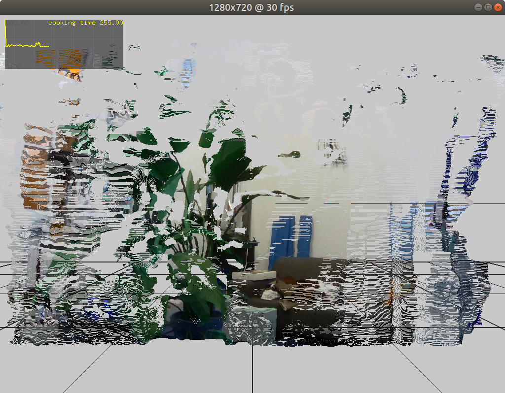
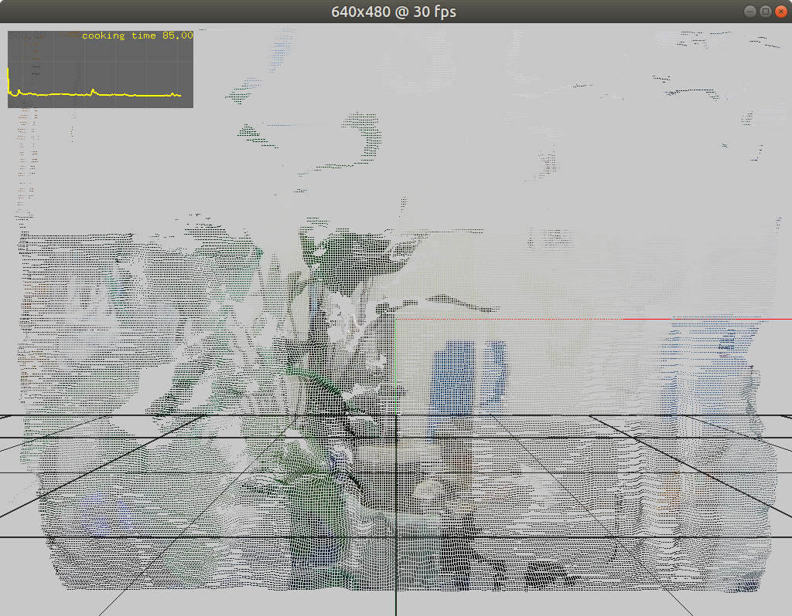
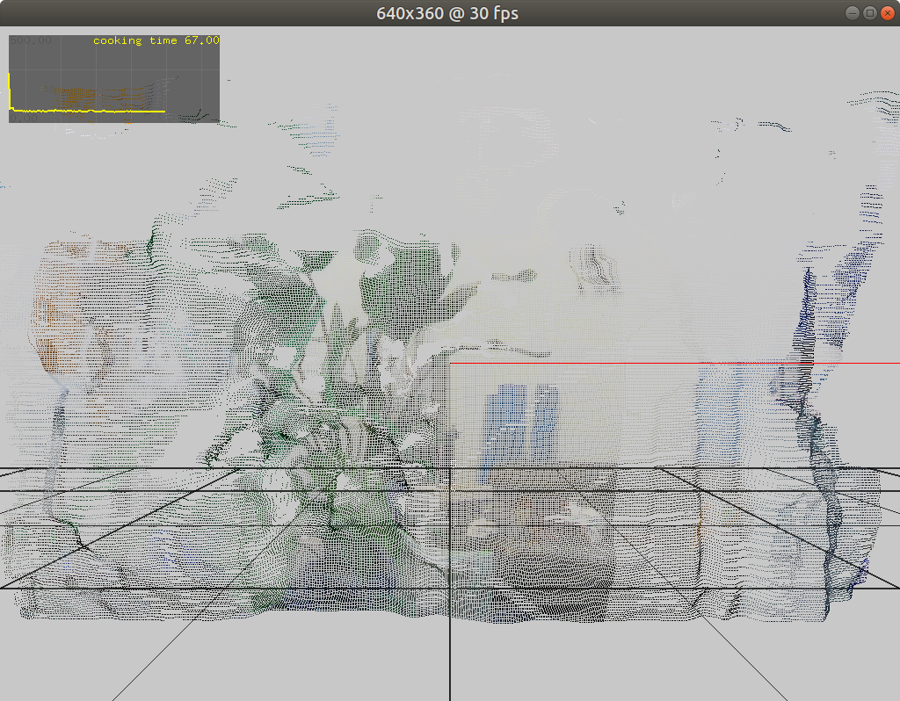

# Point cloud server

Some notes about the pointcloud server. At the time of this writing I am aiming for correctness rather than a super-optimized code-base. Every single sampling point in the frame is processed in every step of the pipeline. This software performs very data-intensive operations so to optimize the focus should be on reducing the amount of data that goes through the pipeline rather than first making code-level optimizations. Backround removal seems like the most obvious way to optimize the pipeline, it could easily save 75% of the time.

I made an abstract dat structure to contain all the data in the point cloud, mostly to make it easy to compress and send over the network. If we were visualizing this data directly on the server this wouldn't be necessary. A few words about the data structure that is used to contain the point cloud.

This is how the data structure is defined:

```
typedef struct PointcloudData {
    unsigned long seq; // frame sequence number
    unsigned long count; // point count
    int width;
    int height;
    unsigned char *color; // r,g,b data
    float *vertices; // x, y, z data
    float *texture; // u,v data
} tPointcloudData;
```

It has three buffers:
- the `color` buffer is used to represent the RGB values of every sample
- the `vertex` buffer is used to represent the X, Y and Z coordinates as floats
- the `texture` buffer is used to store the U, V coordinates for texturing

### Data throughput



At HD capture resolution (1280x720) the point cloud contains:
| points | color bytes | vertex bytes | texture bytes | total bytes |
| ---- | ---- | ---- | ---- | ---- |
| 921600 | 2764800 | 11059200 | 7372800 | 21196800 |



At 640x480 capture resolution:
| points | color bytes | vertex bytes | texture bytes | total bytes |
| ---- | ---- | ---- | ---- | ---- |
| 307200 | 921600 | 3686400 | 2457600 | 7065600 |



At 640x360 resolution:
| points | color bytes | vertex bytes | texture bytes | total bytes |
| ---- | ---- | ---- | ---- | ---- |
| 230400 | 691200 | 2764800 | 1843200 | 5299200 |

#### Compression

To keep datarates over the network to aminimum, all frame data is compressed before being pumped through the UDP protocol. To compress it I used the Snappy library from Google. It's focused on speed and (de)compression and it gets fairly good compression ratios (0.56 aprox).

### Frame cooking times

Cooking a frame means:
1. the frame is acquired from the camera stream
2. the data is copies to an intermediary data structure
3. an openFrameworks mesh is constructed from the intermediary data structure to check for correctness and to visualize on screen
4. the resulting data structure is compressed

Cooking times at tested resolutions: 
- 255 ms at (1280x720) HD  (roughly: 4fps)
- 100 ms at (640x480) (roughly 10fps)
- 30 ms at (640x360) (roughly 33fps)

Mesh reconstruction takes about 25ms on average, peaks at 32ms more or less.

### Mesh reconstruction algorithm

At the moment, mesh reconstruction looks like this, the `cloud` data structure is our abstract representation. The `mesh` object is an openFrameworks `ofMesh` instance. A similar reconstruction will have to be made in Unity.

```
void ofApp::buildMesh(ofxHslabPointcloud &cloud) {
    mesh.clear();
    if(cloud.pcdata.count !=0 ){
        const float *vs = cloud.pcdata.vertices;
        for(int i = 0; i < cloud.pcdata.count; i++){
            if(vs[i+2]){
                int x = static_cast<int>(cloud.pcdata.texture[i] * cloud.pcdata.width);
                int y = static_cast<int>(cloud.pcdata.texture[i+1] * cloud.pcdata.height);

                if (y < 0 || y >= cloud.pcdata.height) { continue; }
                if (x < 0 || x >= cloud.pcdata.width) { continue; }
                int cloc = (y * cloud.pcdata.width + x) * 3;

                //const rs2::vertex v = vs[i];
                glm::vec3 v3(vs[i*3],vs[(i*3)+1],vs[(i*3)+2]);
                mesh.addVertex(v3);

                unsigned char r = cloud.pcdata.color[i*3];
                unsigned char g = cloud.pcdata.color[(i*3) + 1];
                unsigned char b = cloud.pcdata.color[(i*3) + 2];

                mesh.addColor(ofColor(r, g, b));
            } // if
        } // for
    } // if
}
```
